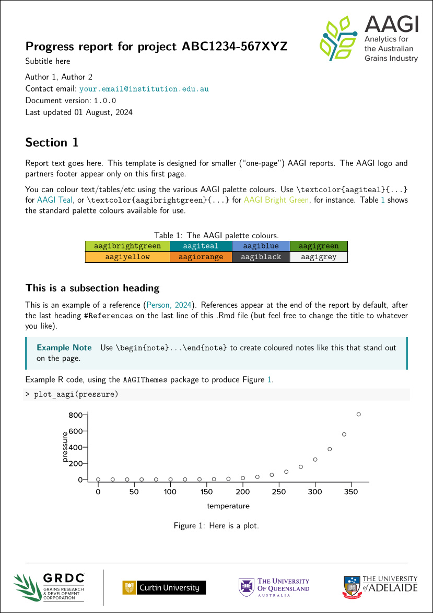

# AAGITemplates

<!--Badges... -->
[](https://www.repostatus.org/#active)
[](/DESCRIPTION)

Rmarkdown, LaTeX and Knitr reporting templates for AAGI staff.

<!--Previews -->
|<br>AAGI Report|<br>AAGI Short Report|<br>AAGI HTML Presentation|<br>AAGI Beamer Presentation|
|:-:|:-:|:-:|:-:|

This package adds templates for AAGI reports and presentations to RStudio, accessible graphically via the `File > New File... > R Markdown...` menu and also via the R Console using the `new_report()` function.

## Installation instructions

{AAGITemplates} is available through the [R-Universe](https://r-universe.dev/search) with pre-built binaries (this is the easy way).

To get started:

### Enable this universe

```r
options(repos = c(
    aagi_aus = 'https://aagi-aus.r-universe.dev',
    CRAN = 'https://cloud.r-project.org'))
```

### Install

```r
install.packages("AAGITemplates")
```

### The hard(er) way

Install this R package with:

```{r eval = FALSE}
if(!require("remotes")) install.packages("remotes") 
remotes::install_github("AAGI-AUS/AAGITemplates", upgrade = FALSE)
```

## Installing the Microsoft Office templates

The AAGI report/presentation templates for Microsoft Word and Microsoft PowerPoint can be installed easily on a Windows 10/11 SOE by the following steps.

1. Download the .dotx and .potx template files from this GitHub directory to your machine (e.g., by clicking the following links):
    - [AAGI Report Template](<https://github.com/AAGI-AUS/AAGITemplates/raw/master/inst/rmarkdown/templates/Word_report/AAGI Report Template.dotx>)
    - [AAGI Short Report Template](<https://github.com/AAGI-AUS/AAGITemplates/raw/master/inst/rmarkdown/templates/Word_report/AAGI Short Report Template.dotx>)
    - [AAGI PowerPoint Presentation](<https://github.com/AAGI-AUS/AAGITemplates/raw/master/inst/rmarkdown/templates/PowerPoint_presentation/AAGI PowerPoint Presentation.potx>)
1. Copy and paste the template files into your "Custom Office Templates" directory. (This directory usually already exists in your User folder, but if the directory does not exist you can create it anywhere you like.)<br>
1. Open Microsoft Word and open the Options window. Navigate to the Save menu, and under Default personal templates location make sure that your "Custom Office Templates" directory is listed. If it's not already populated, just copy and paste your directory path from the previous step into this box.<br>

If the templates are found successfully, then these AAGI report templates should be available under the 'Personal' tab when creating a new document in Microsoft Word (and also when creating a new presentation in Microsoft PowerPoint).
|||
|:-:|:-:|

## Logo Rights

Note that the logo of the AAGI project and the logos for the GRDC and AAGI strategic partners do not fall under the MIT License.
AAGI retains full rights to the AGGI logo. The GRDC and the AAGI strategic partners&mdash;Curtin University, the University of Queensland and the University of Adelaide/Adelaide University&mdash;retain full rights to their own logos respectively.


